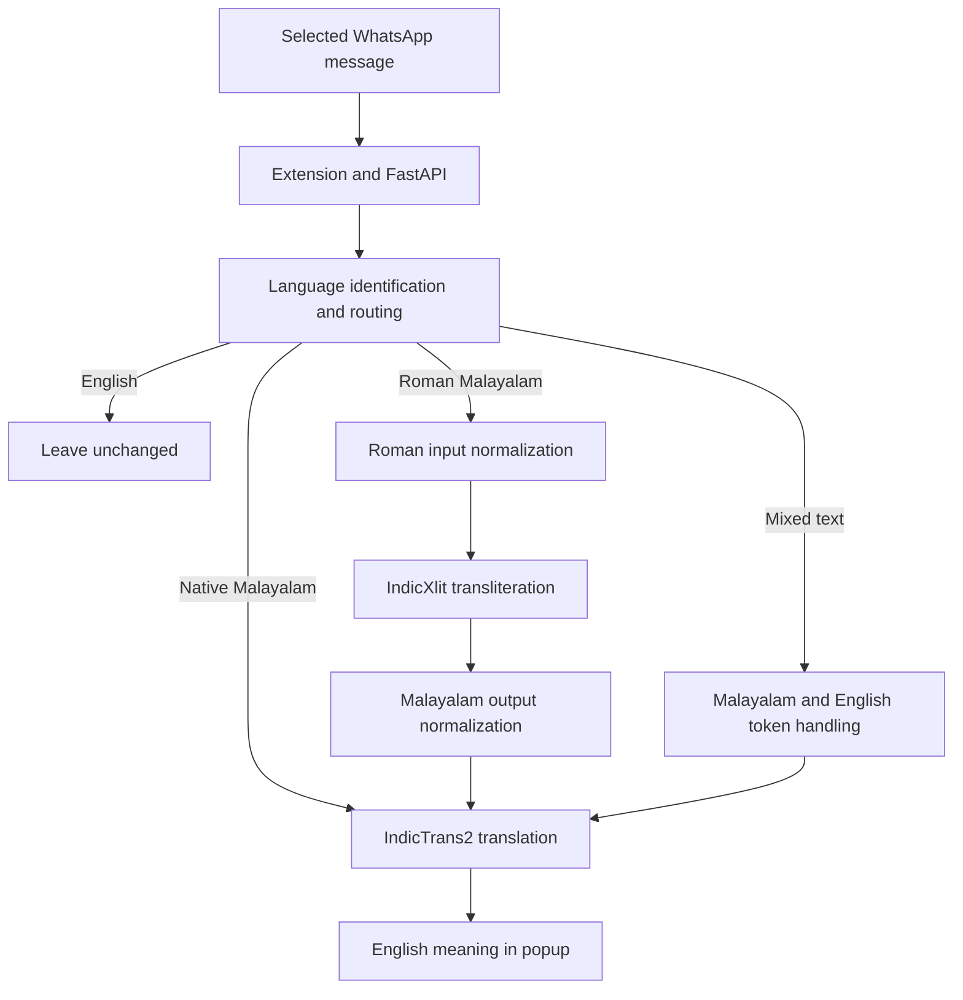

# Malayalam WhatsApp Translator

A Chrome extension project that aims to help people understand Malayalam messages on WhatsApp Web by showing their English meaning.

The project covers **native Malayalam**, **Romanized Malayalam (Manglish)** and **mixed Malayalam-English chat**. Its core product requirement is to preserve ordinary English messages while translating Malayalam-family text.

> **Development snapshot — 14 September 2026:** The extension and FastAPI foundation work, and language-routing, transliteration and preprocessing experiments have been recorded. Real model inference is still being connected to the backend. The current `/translate` endpoint returns `language: "unknown"` and `translation: null`.

This project focuses on language identification and translation. It is not an AI summarizer or chatbot.

[Progress](#project-progress) · [What we built](#what-we-built) · [Integrations](#tools-and-integrations) · [Evaluation](#evaluation-results) · [CI and bots](#ci-bots-and-quality-checks) · [Learnings](#what-we-learned-and-how-it-shapes-future-work) · [Roadmap](#next-milestones) · [Validation](#local-validation)

## Why this project exists

WhatsApp messages often mix languages, scripts, abbreviations and informal spellings. A person unfamiliar with Malayalam may struggle with both Malayalam script and Malayalam written using Latin characters.

Examples of the inputs this project is designed to handle:

| Input type | Example | Intended handling |
| --- | --- | --- |
| Native Malayalam | `നാളെ വരാം` | Translate Malayalam into English. |
| Roman Malayalam | `Enikku manasilayi` | Identify Malayalam, convert to Malayalam script when needed, then translate. |
| Mixed Malayalam-English | `Njan innu busy aanu` | Handle the Malayalam content while preserving the English meaning. |
| Mixed scripts | `നാളെ class online ആണോ?` | Recognize Malayalam content alongside English tokens. |
| English | `Can you send me the file?` | Leave unchanged. |

These describe the target behavior. The current extension can submit selected text to the API, but the complete translation flow is still under development.

## Project progress

### Where the work currently lives

The default branch is `main`. **PR #4 merged on 14 September 2026**; its Phase 8 contract, notebook and workflows are now on `main`. **PR #3 remains open and unmerged**, so its reliability improvements and broader CI still need integration.

| Location | Snapshot commit | Work available |
| --- | --- | --- |
| [`main`](https://github.com/sakethalladaaa/malayalam-whatsapp-translator/tree/main) | `826f5fb` | Extension/API foundation, Phase 5–7 evaluation artifacts and merged Phase 8 contract/notebook/CI. |
| [PR #3 — Phase 1–7 gaps](https://github.com/sakethalladaaa/malayalam-whatsapp-translator/pull/3) | `6e5d041` | API tests and schemas, extension reliability fixes, normalization boundary fixes and broader CI. |
| [PR #4 — Phase 8 IndicLID contract](https://github.com/sakethalladaaa/malayalam-whatsapp-translator/pull/4) | `62f38fc` (merged) | Adapter/router contract, Colab notebook work, notebook checks, workflow lint, Ruff, CodeQL, dependency audit and Dependabot configuration. |

PR #3 contains separate changes. Its earlier green checks do not establish compatibility with the current `main`; reconcile overlapping files and validate the combined state before merging.

### Phase-by-phase status

| Phase | Scope | Outcome and current status |
| --- | --- | --- |
| 0 | Repository and development setup | Foundation complete. |
| 1 | FastAPI backend | Health endpoint and validated translation request/response scaffold implemented; additional schema organization and API tests in PR #3. |
| 2 | Extension popup | Selected-text popup, Translate button, loading state and result area implemented. |
| 3 | Extension-to-backend communication | HTTP/JSON request flow implemented; timeout and error-handling improvements in PR #3. |
| 4 | WhatsApp Web DOM integration | Message-container helpers implemented; stricter single-message selection and viewport fixes in PR #3. |
| 5 | IndicLID evaluation and Malayalam routing | Evaluation complete; historical `candidate_v1` policy frozen. |
| 6 | IndicXlit transliteration | Evaluation complete on a 75-sample project dataset; production API integration pending. |
| 7 | Roman input and Malayalam output normalization | Two experiments documented; retained preprocessing candidate and additional regression hardening in PR #3. |
| 8 | IndicLID runtime reproduction and backend integration | In progress. Contract tests and notebook work from PR #4 are merged; reproducibility follow-ups and actual backend model loading remain open. |

IndicTrans2 integration and semantic evaluation of the full Malayalam-to-English flow remain future work.

## What we built

### Extension and API foundation

- A Manifest V3 Chrome extension with content scripts scoped to WhatsApp Web.
- A popup that displays selected text, submits a translation request and shows the response or an unavailable/error state.
- A small WhatsApp DOM helper module so message selectors are separate from general popup and request code.
- A FastAPI backend with `GET /health` and `POST /translate`.
- Pydantic validation that trims input, rejects blank or invalid text and limits input to 5,000 characters.
- A JSON response contract with `input`, `language` and `translation` fields.

For example, the current API accepts:

```json
{"text": "Njan innu busy aanu"}
```

It returns the scaffold response:

```json
{
  "input": "Njan innu busy aanu",
  "language": "unknown",
  "translation": null
}
```

The request reaches the backend, but this response does not perform language identification or translation. See the [current endpoint implementation](https://github.com/sakethalladaaa/malayalam-whatsapp-translator/blob/9e4b7c83d2c6f210cfc1bbab7a07884df769dfd1/backend/app/main.py).

### Reliability improvements in PR #3

| Change | Why we added it |
| --- | --- |
| Centralized request and response schemas | Keep the API contract in one place as backend modules grow. |
| 11 API test cases | Cover health, valid input, trimming, missing/invalid values and the 5,000-character boundary. |
| 15-second request timeout using `AbortController` | Give users a recoverable result when the service stops responding. |
| Validation, server, connection and invalid-JSON handling | Make failures understandable in the popup. |
| Anchor and focus must belong to the same WhatsApp message container | Prevent a selection spanning multiple messages from being submitted. |
| Popup positioning within viewport bounds | Improve usability near screen edges. |
| Complete-token Malayalam normalization, including combining marks and joiners | Prevent a short correction rule from altering part of a longer Malayalam word. |
| 10 preprocessing regression tests | Preserve longer words, punctuation, Roman token boundaries, case behavior and empty-input handling. |

These changes are reviewable in [PR #3](https://github.com/sakethalladaaa/malayalam-whatsapp-translator/pull/3). Browser checks are recorded in that PR; the JavaScript CI check only verifies syntax.

### NLP experiments and Phase 8 contract

The project has committed evaluation datasets, output CSVs, failure analyses, preprocessing code and an IndicXlit inference wrapper.

Merged PR #4 provides:

- **An IndicLID adapter boundary:** `LIDResult`, empty-input validation and an explicit `IndicLIDUnavailableError` when inference is requested without a configured runtime.
- **A routing contract:** `malayalam_native`, `roman_malayalam`, `mixed` and `english` categories, with conservative Roman Malayalam markers and unit tests.
- **A Colab notebook:** a pinned upstream IndicLID revision, a legacy BERT inference compatibility patch, explicit weight-transfer checks and saved batch/direct-BERT smoke-test output.

The adapter currently does not load or run IndicLID. The router is independently callable but is not connected to `/translate`.

The Phase 8 marker inventory is a **conservative reconstruction** of the documented policy. The original Phase 5 implementation and runtime artifacts were not committed. The reconstruction also includes script-based handling, so the historical Phase 5 metrics must not be attributed to it.

The router's `english` category is its default processing route, not proof that arbitrary input is English. For example, the unrecognized Roman Malayalam phrase `vegam vaa` currently falls through to that route. A recognized IndicLID Malayalam label takes precedence over the script-based mixed route.

Sources: [adapter](https://github.com/sakethalladaaa/malayalam-whatsapp-translator/blob/9e4b7c83d2c6f210cfc1bbab7a07884df769dfd1/backend/app/lid.py), [router and policy boundary](https://github.com/sakethalladaaa/malayalam-whatsapp-translator/blob/9e4b7c83d2c6f210cfc1bbab7a07884df769dfd1/backend/app/router.py), [Phase 8 notebook](https://github.com/sakethalladaaa/malayalam-whatsapp-translator/blob/9e4b7c83d2c6f210cfc1bbab7a07884df769dfd1/Phase8_IndicLID_Fix.ipynb).

## Tools and integrations

| Tool or technology | Role in this project | Integration status |
| --- | --- | --- |
| [Python](https://www.python.org/) | Backend, model wrappers, evaluation and validation scripts | Used; backend/contract CI uses Python 3.11. |
| [FastAPI](https://fastapi.tiangolo.com/) and Pydantic | API endpoints, request validation and response schemas | Scaffold implemented; NLP wiring pending. |
| [Uvicorn](https://www.uvicorn.org/) | Serve the FastAPI application during development | Development server. |
| JavaScript, CSS and Chrome Manifest V3 | WhatsApp content scripts, popup interaction and presentation | Foundation implemented; additional reliability work in PR #3. |
| [IndicLID](https://github.com/AI4Bharat/IndicLID) | Identify native and Roman-script Malayalam before routing | Evaluated; runtime reproduction in progress; backend adapter is a contract only. |
| [IndicXlit](https://github.com/AI4Bharat/IndicXlit) | Convert Roman Malayalam to Malayalam script | Evaluation wrapper and results committed; API invocation pending. |
| [IndicTrans2](https://github.com/AI4Bharat/IndicTrans2) | Translate Malayalam script into English | Planned. |
| Google Colab, PyTorch, Transformers and fastText | IndicLID runtime investigation and inference experiments | Notebook evidence committed; complete reproducible setup pending. |
| Git and GitHub pull requests | Version history, focused changes, review and validation evidence | In use. |
| pytest, unittest and Node.js | API/router/preprocessing tests, notebook-validator tests and JavaScript syntax checks | Configured across PR #3 and PR #4. |
| GitHub Actions, Ruff, CodeQL, pip-audit and Dependabot | Automated checks and dependency maintenance | Phase 8 automation is on `main`; broader CI remains in open PR #3. |
| Google Chrome and Visual Studio Code | Browser verification and development | Development tools. |

Model environments are separate from the API/test environment. The recorded IndicXlit evaluation used Python 3.10.21 and pip 24.0 for its legacy dependency stack. Python 3.13 in notebook CI is used for **static validation**; it does not certify model-runtime compatibility.

## Target architecture

The intended processing pipeline is:



The selection/API foundation exists. Model execution, mixed-language token handling and the complete translation path in this diagram are integration targets.

## Evaluation results

These are recorded results on manually authored project datasets. They are not standardized benchmark scores or measurements of final English translation quality. No model evaluation was rerun for this README update.

### Phase 5: frozen language-routing candidate

The balanced final set contains 100 messages: 25 native Malayalam, 25 Roman Malayalam, 25 mixed Malayalam-English and 25 English.

| Metric | Recorded result |
| --- | ---: |
| Malayalam-family routing accuracy | 97.00% |
| Malayalam-family precision | 100.00% |
| Malayalam-family recall | 96.00% |
| F1 | 97.96% |
| English false positives | 0 / 25 |
| Malayalam-family messages routed correctly | 72 / 75 |

These measure the binary Malayalam-family versus English routing decision, not perfect four-category language classification.

The frozen `candidate_v1` routes to Malayalam when IndicLID returns `mal_Mlym` or `mal_Latn`, or when the lexical fallback finds enough markers: at least one for messages of up to four words, and at least two for longer messages.

The three misses were retained, including `vegam vaa` and mixed-script examples. Zero observed false positives on 25 English examples does not establish zero false positives on all English messages.

See the [Phase 5 evaluation report](https://github.com/sakethalladaaa/malayalam-whatsapp-translator/blob/main/phase5/evaluation/README.md).

### Phase 6: raw IndicXlit transliteration

| Metric | Recorded result on 75 messages |
| --- | ---: |
| Exact match | 22 / 75 — 29.33% |
| Mean normalized character similarity | 91.43% |
| Median normalized character similarity | 94.74% |
| Similarity at least 0.90 | 53 / 75 |

The model generally generated Malayalam script, but short informal expressions, spelling variation, slang, hyphenation and English abbreviations remained difficult. Exact match measures string agreement; character similarity measures surface closeness. Neither establishes preserved meaning.

See the [75-sample failure analysis](https://github.com/sakethalladaaa/malayalam-whatsapp-translator/blob/main/phase6/evaluation/FAILURE_ANALYSIS.md).

### Phase 7: controlled preprocessing experiments

| Experiment | Evidence | Outcome |
| --- | --- | --- |
| Malayalam output normalization | Historical Phase 6 set, 75 samples | Exact matches increased from 22 to 25; mean similarity increased from 91.43% to 92.19%. This was correction of known historical patterns. |
| Same output normalization | Separate Phase 7 holdout, 30 samples | Changed 0 outputs; no measured improvement or regression. |
| Roman input normalization | Separate development set, 20 samples | Exact match increased from 30.00% to 40.00%; a harmful candidate rule was rejected. |
| Retained Roman input candidate | Phase 7 holdout, 30 samples | Exact match increased from 43.33% to 46.67%; mean similarity increased from 93.98% to 94.34%; 2 improved, 28 unchanged, 0 worsened. |

Retained Roman rules are complete-token corrections: `nale → naale`, `ariyamo → ariyaamo` and `inu → innu`. The candidate `evida → evideyaa` was rejected after a development-set regression.

The holdout is now evaluated and frozen. Further rules need a separate development source and fresh evaluation; existing holdouts must not become tuning data.

See [Experiment 1](https://github.com/sakethalladaaa/malayalam-whatsapp-translator/blob/main/phase7/evaluation/EXPERIMENT_1_RESULT.md) and [Experiment 2](https://github.com/sakethalladaaa/malayalam-whatsapp-translator/blob/main/phase7/evaluation/EXPERIMENT_2_RESULT.md).

## CI, bots and quality checks

Each check covers a different part of the project. Dependabot proposes dependency updates; GitHub Actions runs the automated validation jobs.

### What we added and why

| Check or bot | What it covers | Why it matters for future work |
| --- | --- | --- |
| Broader repository CI — PR #3 | Backend/API tests, Phase 7 preprocessing tests and `node --check` for the extension | Preserve API behavior and normalization boundaries while adding models. |
| Phase 8 contract tests — PR #4 | Backend Python compilation and 13 adapter/router tests on Python 3.11 | Keep the inference boundary and tested routing behavior stable while the runtime is implemented. |
| Notebook validation — PR #4 | Tracked notebook JSON/schema, Python and Bash/sh syntax, saved execution errors; 9 tests for the validator on Python 3.13 | Catch broken experiment files and validator failure cases without downloading or executing models. |
| actionlint — PR #4 | Workflow structure, expressions and supported shell checks | Catch mistakes in the automation itself before new checks depend on it. |
| Ruff — PR #4 | `ruff check` across `backend`, `phase6`, `phase7` and `scripts` | Catch Python lint problems as the codebase grows. No separate formatting check is configured. |
| CodeQL — PR #4 | Separate Python and JavaScript/TypeScript source analysis, uploaded to GitHub Code Scanning | Help reviewers identify potential security issues in application code. |
| pip-audit — PR #4 | Known vulnerabilities in dependencies resolved from the API/test and notebook-validation manifests | Make dependency review part of normal development. This does not audit model files or unlisted runtime packages. |
| Dependabot — PR #4 | Grouped weekly GitHub Actions and pip updates for `/` and `/.github`, with five open version-update PRs allowed per entry | Reduce manual update tracking; changes still need review and validation. |

The Phase 8 workflows also use job timeouts, cancellation of superseded runs, restricted job permissions and checkout without persisted credentials. The actionlint download and Ruff executable use checksum verification.

### Workflow files and triggers

| Workflow | Source | Configured triggers |
| --- | --- | --- |
| CI | [PR #3: ci.yml](https://github.com/sakethalladaaa/malayalam-whatsapp-translator/blob/6e5d041b37d63da207d460264d2442373c3720ee/.github/workflows/ci.yml) | Pull requests targeting `main`; pushes to `main`. |
| Phase 8 CI | [phase8.yml](https://github.com/sakethalladaaa/malayalam-whatsapp-translator/blob/9e4b7c83d2c6f210cfc1bbab7a07884df769dfd1/.github/workflows/phase8.yml) | Pull requests targeting `main`; pushes to `main`; manual trigger declared. |
| Python Quality | [ruff.yml](https://github.com/sakethalladaaa/malayalam-whatsapp-translator/blob/9e4b7c83d2c6f210cfc1bbab7a07884df769dfd1/.github/workflows/ruff.yml) | Pull requests targeting `main`; pushes to `main`; manual trigger declared. |
| CodeQL | [codeql.yml](https://github.com/sakethalladaaa/malayalam-whatsapp-translator/blob/9e4b7c83d2c6f210cfc1bbab7a07884df769dfd1/.github/workflows/codeql.yml) | Pull requests targeting `main`; pushes to `main`; weekly; manual trigger declared. |
| Python Dependency Audit | [dependency-audit.yml](https://github.com/sakethalladaaa/malayalam-whatsapp-translator/blob/9e4b7c83d2c6f210cfc1bbab7a07884df769dfd1/.github/workflows/dependency-audit.yml) | Pull requests targeting `main`; pushes to `main`; weekly; manual trigger declared. |

Scheduled workflows run from the default branch; GitHub's normal “Run workflow” UI requires the workflow there. The Phase 8 workflows are now on `main` following PR #4's merge. See [GitHub workflow triggers](https://docs.github.com/en/actions/reference/workflows-and-actions/events-that-trigger-workflows).

[Dependabot's configuration](https://github.com/sakethalladaaa/malayalam-whatsapp-translator/blob/9e4b7c83d2c6f210cfc1bbab7a07884df769dfd1/.github/dependabot.yml) is now on `main`. GitHub recorded successful Dependabot update runs after the merge; see [Dependabot setup](https://docs.github.com/en/code-security/how-tos/secure-your-supply-chain/secure-your-dependencies/configure-version-updates).

Adding a workflow does not automatically make it a required merge check. Required checks are a separate repository configuration.

### Verified GitHub Actions snapshot

GitHub recorded successful runs for `main` commit `826f5fb78362ce4afd029358515fb0a7fa46304c` on 14 September 2026:

| Workflow | Recorded result |
| --- | --- |
| [Phase 8 CI](https://github.com/sakethalladaaa/malayalam-whatsapp-translator/actions/runs/34869016971) | Passed |
| [Python Quality](https://github.com/sakethalladaaa/malayalam-whatsapp-translator/actions/runs/34869017177) | Passed |
| [Python Dependency Audit](https://github.com/sakethalladaaa/malayalam-whatsapp-translator/actions/runs/34869017003) | Passed |
| [CodeQL](https://github.com/sakethalladaaa/malayalam-whatsapp-translator/actions/runs/34869016988) | Passed |

These runs do not include PR #3's broader CI workflow.

These are GitHub-recorded results for specific commits. New commits need their own checks; consult the [Actions page](https://github.com/sakethalladaaa/malayalam-whatsapp-translator/actions) for later runs.

Green checks establish the behavior covered by those checks. They do not execute the IndicLID notebook, prove a fresh Colab setup, validate real backend inference or measure translation meaning. A successful vulnerability audit covers known advisories for the dependencies resolved at that time.

See [CI validation details](https://github.com/sakethalladaaa/malayalam-whatsapp-translator/blob/9e4b7c83d2c6f210cfc1bbab7a07884df769dfd1/docs/CI.md).

## What we learned and how it shapes future work

The implications below connect the recorded experiments and code changes to the next engineering decisions.

| Observation or problem | Learning | Effect on future development |
| --- | --- | --- |
| The frozen router missed short Roman and mixed-script messages while protecting all 25 English controls. | Routing quality involves a recall/false-positive tradeoff; a small test set cannot establish universal accuracy. | Retain the baseline, add new independent cases and evaluate English protection alongside Malayalam recall. |
| Phase 5 results survived, but its original implementation/runtime artifacts were absent from Git. | Metrics alone are insufficient to reproduce a system. | Preserve source revision, configuration, runtime versions and evaluation outputs together; measure the Phase 8 reconstruction independently. |
| IndicXlit/Fairseq required an isolated legacy environment and installer compatibility work. | Model dependencies can have different requirements from the web application. | Keep model environments separate, pin a tested stack and document compatibility settings before integrating it. |
| An assumed class-style type annotation for the IndicXlit factory failed; repeated engine creation would add overhead. | External API behavior and model lifetime need explicit verification. | Keep adapters small and plan model reuse during evaluation and backend inference. |
| Phase 6 showed high character similarity but low exact match. | String agreement and meaning preservation answer different questions. | Evaluate routing, transliteration and final English meaning separately; inspect errors by message category. |
| Output normalization corrected historical examples but changed none of the 30 holdout outputs. | Fixing known examples does not establish generalization. | Keep historical corrections labeled honestly and require fresh evidence for broader quality claims. |
| Three Roman spelling rules helped modestly, while `evida → evideyaa` harmed a development example. | More normalization rules can create regressions. | Add rules from development evidence, compare improvements and regressions, and freeze the final holdout. |
| Naive Malayalam substring replacement could change longer words. | Unicode combining marks and token boundaries are part of correctness. | Retain boundary regression tests when expanding preprocessing or moving it into the pipeline. |
| Mixed-chat and social-chat categories did not improve under the retained Roman rules. | English abbreviations, code-switching and slang need targeted evaluation. | Investigate English-token preservation and conversational handling as separate experiments. |
| A request can fail through timeout, invalid JSON, server errors or an invalid message selection. | Reliable user interaction requires failure-path behavior as well as successful requests. | Preserve PR #3's request and selection checks when model latency and new API responses are introduced. |
| Saved notebook smoke output exists, but setup paths and dependencies are not yet fully reproducible. | Saved success output is weaker evidence than a fresh run followed by a safe repeated run. | Finish runtime pinning, path handling and stronger batch assertions before claiming Phase 8 reproduction complete. |
| Contract tests, static checks, source scanning and dependency audits cover different risks. | No single green workflow proves product readiness. | Keep fast checks for every change and add real model/API integration and browser/meaning evaluation as those components become available. |

More detail: [Phase 6 engineering learnings](https://github.com/sakethalladaaa/malayalam-whatsapp-translator/blob/main/phase6/evaluation/LEARNINGS_AND_FUTURE.md), [Phase 7 learnings and failures](https://github.com/sakethalladaaa/malayalam-whatsapp-translator/blob/main/phase7/evaluation/LEARNINGS_AND_FAILURES.md), [Phase 8 runtime review](https://github.com/sakethalladaaa/malayalam-whatsapp-translator/pull/4#issuecomment-5655435624).

## Next milestones

| Priority | Work | Evidence needed to call it complete |
| --- | --- | --- |
| 1 | Complete IndicLID notebook reproducibility | Explicit compatible dependency pins and restart guidance; one absolute workspace/model root; setup that preserves an existing checkout and stops on failures; fresh and repeated “Run all” output. |
| 2 | Strengthen runtime smoke tests | Assert output count, input order and expected labels; include genuine Malayalam-plus-English mixed-script text and retain the direct BERT fallback check. |
| 3 | Integrate the still-open Phase 1–7 PR #3 with current `main` | Reconcile overlapping files and rerun the applicable API, preprocessing, contract, notebook, lint and audit checks on the actual combined state. |
| 4 | Implement real IndicLID backend loading and prediction | Adapter tests with the provisioned runtime, FastAPI integration tests and clear unavailable-runtime handling. |
| 5 | Connect routing, preprocessing, IndicXlit and IndicTrans2 | End-to-end results for native Malayalam, Roman Malayalam, mixed messages and unchanged English controls. |
| 6 | Evaluate final meaning and extension behavior | Separate semantic translation evaluation plus browser checks for responses, latency, failures and message selection. |

The notebook already verifies missing and unexpected weight-transfer keys, permitting a documented legacy buffer difference. Its saved outputs include batch and direct-BERT examples. The remaining reproducibility items are tracked in the [PR #4 follow-up](https://github.com/sakethalladaaa/malayalam-whatsapp-translator/pull/4#issuecomment-5655435624) and [issue #2](https://github.com/sakethalladaaa/malayalam-whatsapp-translator/issues/2).

DCO sign-off checking and SonarQube Cloud remain pending setup decisions; no DCO check or Sonar quality gate is enabled in the documented configuration.

## Local validation

Use the environment appropriate to the branch and check being run. The commands below are validation references; CI dependencies do not install IndicLID, IndicXlit or IndicTrans2.

### Main (merged PR #4): adapter and router checks

From the repository root in an activated Python 3.11 environment:

```bash
python -m pip install -r requirements-ci.txt
python -m compileall -q backend
PYTEST_DISABLE_PLUGIN_AUTOLOAD=1 python -m pytest backend/tests/test_lid.py backend/tests/test_router.py -q
```

### Main (merged PR #4): static notebook checks

To match notebook CI, use a separate Python 3.13 environment:

```bash
python -m pip install -r .github/requirements-notebook-ci.txt
python -m unittest discover -s scripts/tests -v
python scripts/check_notebooks.py
```

These commands validate notebook files without executing their cells.

### Main (merged PR #4): lint and dependency checks

Use the Python 3.11 tooling environment:

```bash
python -m pip install ruff==0.16.7 -r .github/requirements-audit.txt
python -m ruff check backend phase6 phase7 scripts
python -m pip_audit -r requirements-ci.txt
python -m pip_audit -r .github/requirements-notebook-ci.txt
```

`requirements-ci.txt` pins direct API/test dependencies; it is not a complete transitive lockfile or a model-runtime manifest. Notebook tooling and pip-audit have their own manifests. The Phase 8 contract CI job itself installs only its pinned pytest dependency.

### PR #3: API, preprocessing and extension checks

In a Python 3.11 environment with the dependencies from [PR #3's CI workflow](https://github.com/sakethalladaaa/malayalam-whatsapp-translator/blob/6e5d041b37d63da207d460264d2442373c3720ee/.github/workflows/ci.yml), and Node.js available:

```bash
PYTEST_DISABLE_PLUGIN_AUTOLOAD=1 python -m pytest backend/tests -q
PYTEST_DISABLE_PLUGIN_AUTOLOAD=1 python -m pytest phase7/tests/test_preprocessing.py -q
node --check extension/src/content.js
```

Browser behavior still needs manual verification. These commands do not download models or assess translation quality.

## Repository guide

| Location | Purpose |
| --- | --- |
| `backend/app/` | FastAPI application; schemas in PR #3 and IndicLID/router modules in PR #4. |
| `backend/tests/` | API tests in PR #3; adapter/router tests in PR #4. |
| `extension/` | Manifest, WhatsApp DOM helpers, content script and popup styling. |
| `phase5/` | Frozen routing dataset, results and report. |
| `phase6/` | IndicXlit wrapper, evaluation code, datasets, results and failure analysis. |
| `phase7/` | Preprocessing, tests, development/holdout data and experiment reports. |
| `Phase8_IndicLID_Fix.ipynb` | IndicLID runtime notebook in PR #4. |
| `scripts/` | Static notebook validator and its tests in PR #4. |
| `.github/` | Workflow files, dependency tooling manifests and Dependabot configuration across the PRs. |
| `docs/` | Project journey, platform notes and CI documentation. |

For project background, see the [development guide](https://github.com/sakethalladaaa/malayalam-whatsapp-translator/blob/6e5d041b37d63da207d460264d2442373c3720ee/DEVELOPMENT.md) and [project journey](https://github.com/sakethalladaaa/malayalam-whatsapp-translator/blob/6e5d041b37d63da207d460264d2442373c3720ee/docs/PROJECT_JOURNEY.md).

## Contributing

Use focused branches and PRs, inspect existing changes before editing, include validation evidence and review the diff before committing. Keep model binaries, caches and virtual environments out of Git.

Preserve the frozen Phase 5 policy and recorded evaluation datasets. Propose new model or preprocessing experiments with a separate development source, an explicit baseline and fresh evaluation evidence. Report failures and unresolved cases alongside improvements.

The project builds on AI4Bharat's [IndicLID](https://github.com/AI4Bharat/IndicLID), [IndicXlit](https://github.com/AI4Bharat/IndicXlit) and planned [IndicTrans2](https://github.com/AI4Bharat/IndicTrans2) integration.
